<h3><code>taha@github ~ $ ./contributions.sh --since 2023</code></h3>

  

<h3><code>taha@github ~ $ whoami</code></h3>

<table>
  <tr>
    <td valign="top" width="330"></td>
    <td valign="top" width="550"></td>
  </tr>
</table>

 

<h3><code>taha@github ~ $ cat contact.txt</code></h3>

  

Portrait, info card, and heatmap are self-contained animated SVGs generated by the scripts in <code>scripts/</code>. The heatmap re-scrapes and re-renders itself every morning via GitHub Actions.

